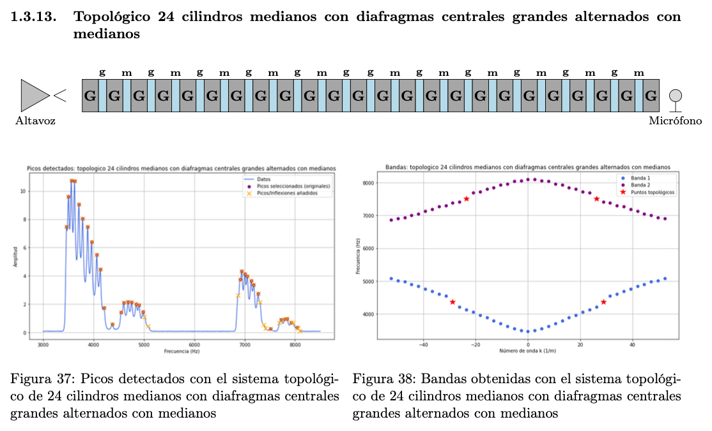
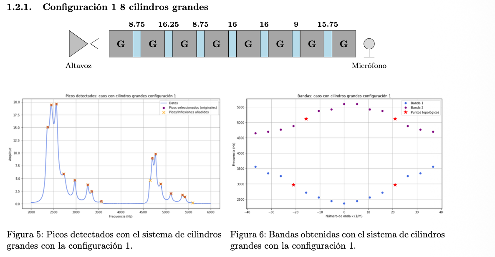
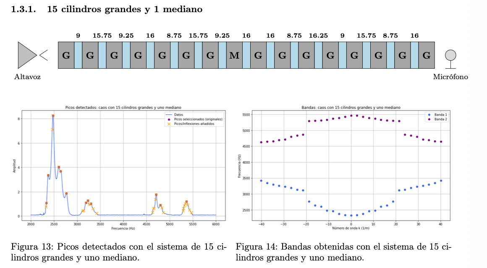
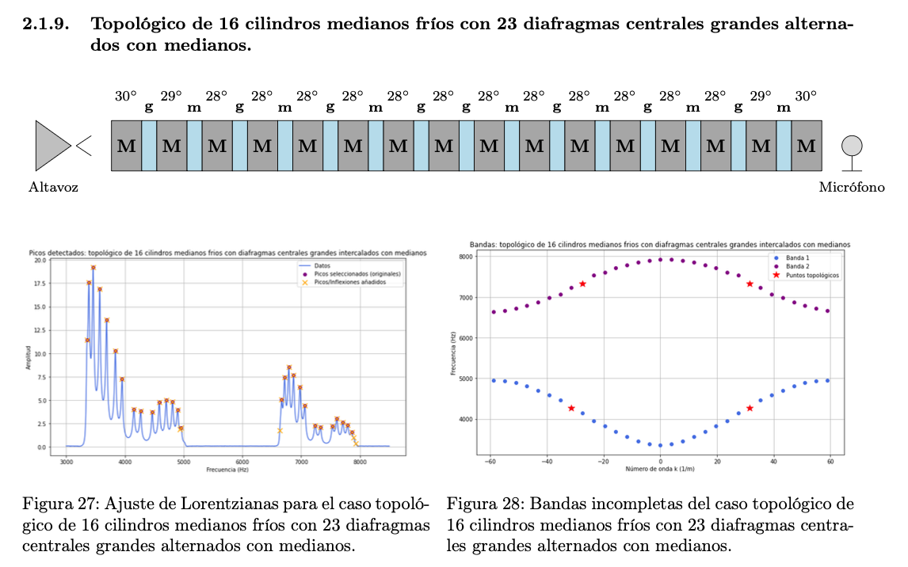

# Acoustic Band Reconstruction and SSH-Inspired Topological Gap Analysis

Computational-physics project for reconstructing acoustic band structures from experimental resonator-chain spectra using peak detection, Lorentzian fitting, missing-mode completion, and careful SSH-inspired interpretation.

## Table of Contents

- [Project Overview](#project-overview)
- [Theory and Background](#theory-and-background)
- [Workflow](#workflow)
- [Selected Results](#selected-results)
- [How to Run](#how-to-run)
- [Repository Structure](#repository-structure)
- [Careful Interpretation of Topological Claims](#careful-interpretation-of-topological-claims)
- [Future Improvements](#future-improvements)

## Project Overview

This repository analyzes one-dimensional coupled cylindrical resonator chains as analogues of tight-binding and SSH systems. The scripts process measured frequency-amplitude data, detect resonances, fit Lorentzian profiles, reconstruct band diagrams, and complete missing points while preserving the distinction between measured and reconstructed values.

Main capabilities:

- automatic resonance detection from experimental spectra,
- multi-Lorentzian fitting for refined peak centers and linewidths,
- band grouping and sub-band separation,
- missing-mode completion with local search and PCHIP interpolation,
- comparative analysis across periodic, disordered, defected, weak-coupling, thermal, and SSH-like configurations.

## Theory and Background

For the full physical framework (acoustic resonators, tight-binding mapping, SSH model, finite-size effects, and interpretation limits), see:

- [`docs/theory_and_background.md`](docs/theory_and_background.md)

Complementary documentation:

- [`docs/methods_and_algorithms.md`](docs/methods_and_algorithms.md)
- [`docs/results_and_discussion.md`](docs/results_and_discussion.md)
- [`docs/implementation_notes.md`](docs/implementation_notes.md)

## Workflow

```text
Experimental .dat spectrum
        |
        v
Peak detection (prominence + amplitude filtering)
        |
        v
Lorentzian fitting and peak-parameter extraction
        |
        v
Band/sub-band grouping by frequency-gap logic
        |
        v
Missing-mode completion (local search + PCHIP)
        |
        v
Reconstructed acoustic band diagram
        |
        v
SSH-inspired physical interpretation with caution checks
```

## Selected Results

### SSH-like long-chain case (24 medium cylinders)


### Disordered baseline case


### Defect-driven localized-feature example


### Thermal perturbation example


## How to Run

Install dependencies:

```bash
python -m venv .venv
source .venv/bin/activate  # Windows: .venv\Scripts\activate
pip install -r requirements.txt
```

Run scripts:

```bash
python src/band_analysis_with_topological_gaps.py
python src/frequency_band_completion_and_lorentzian_fitting.py
```

Expected input format: two columns (`frequency amplitude`) in experimental `.dat` files, with case parameters edited in-script.

## Repository Structure

```text
.
├── README.md
├── requirements.txt
├── .gitignore
├── src/
│   ├── band_analysis_with_topological_gaps.py
│   └── frequency_band_completion_and_lorentzian_fitting.py
├── docs/
│   ├── theory_and_background.md
│   ├── methods_and_algorithms.md
│   ├── results_and_discussion.md
│   └── implementation_notes.md
└── assets/
    ├── ASSETS_INDEX.md
    └── figures/
        ├── comparisons/
        ├── defects/
        ├── disorder/
        ├── temperature/
        ├── topological/
        └── weak_coupling/
```

## Careful Interpretation of Topological Claims

An isolated in-gap peak is **not automatically proof of topological protection**. In this system, disorder, geometric defects, finite-size hybridization, weak coupling, or temperature shifts can create similar signatures.

Stronger topological interpretation requires combined evidence, including:

- gap opening from designed alternating couplings,
- localized mid-gap-like behavior associated with domain-wall or boundary structure,
- reproducibility across related configurations,
- robustness under moderate perturbations,
- separation from ordinary defect/thermal explanations.
