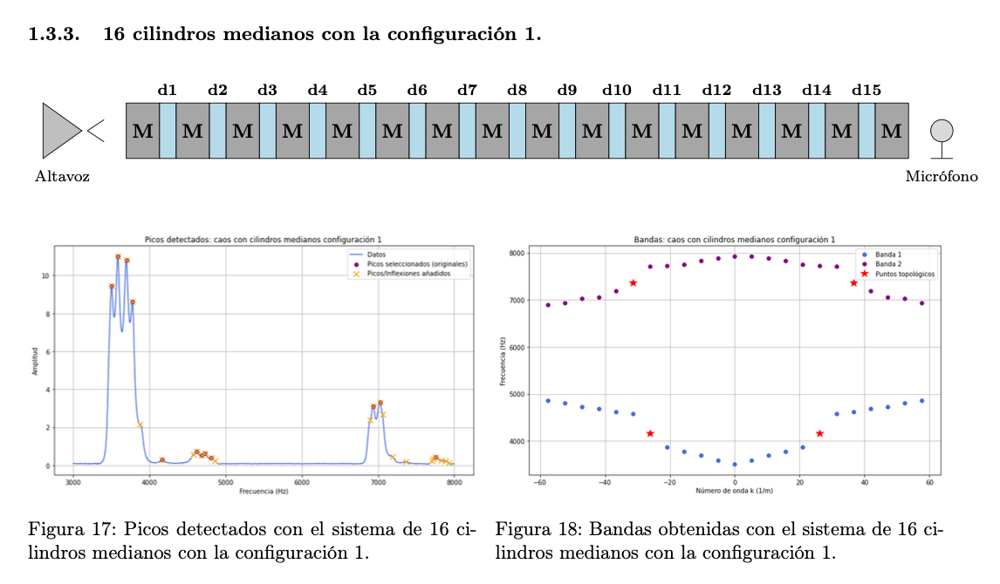
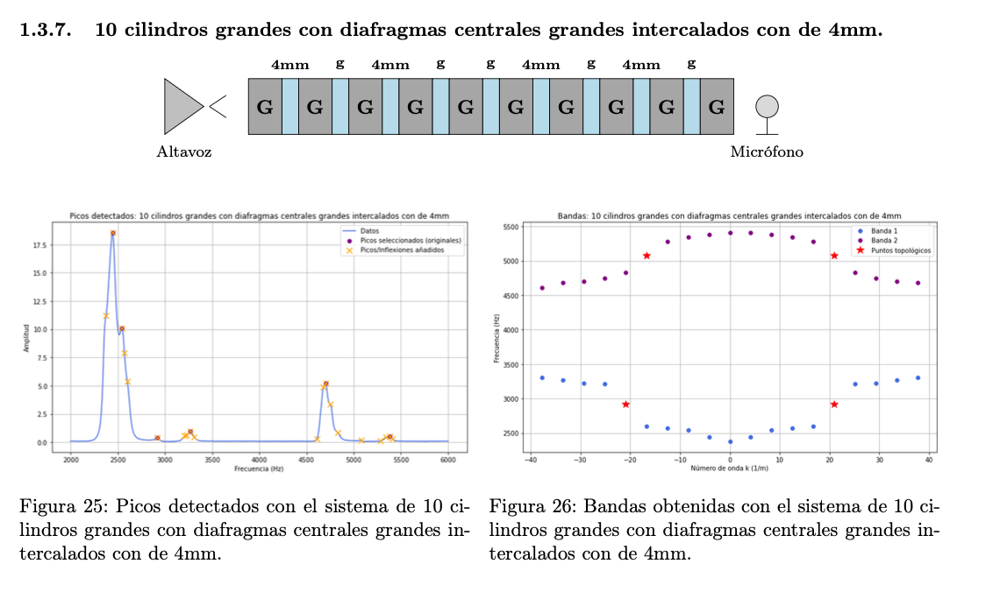
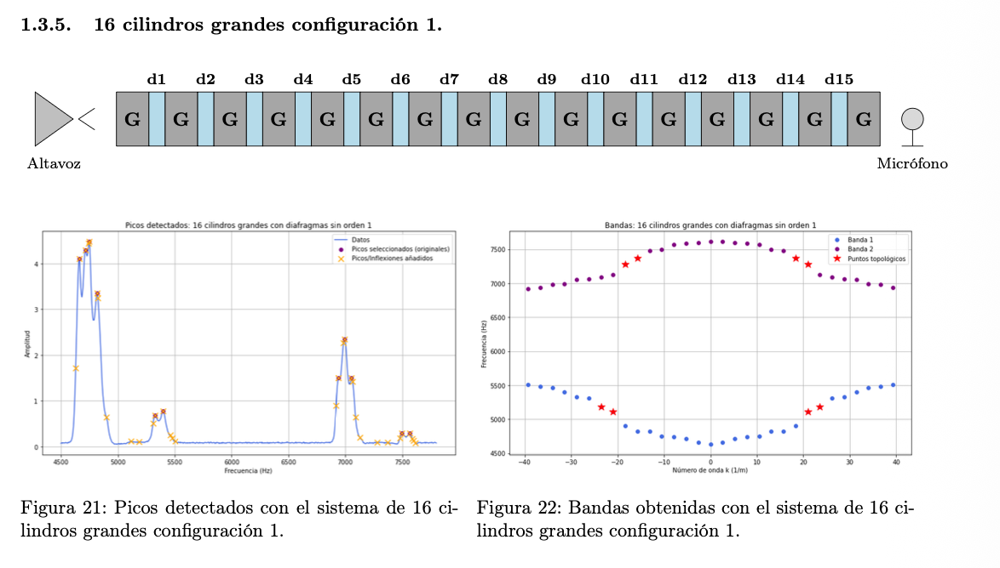
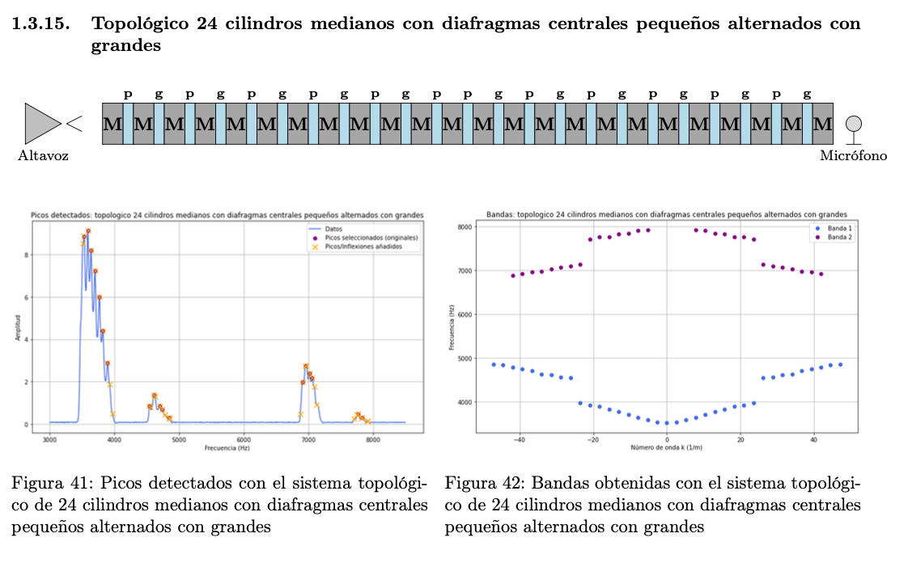
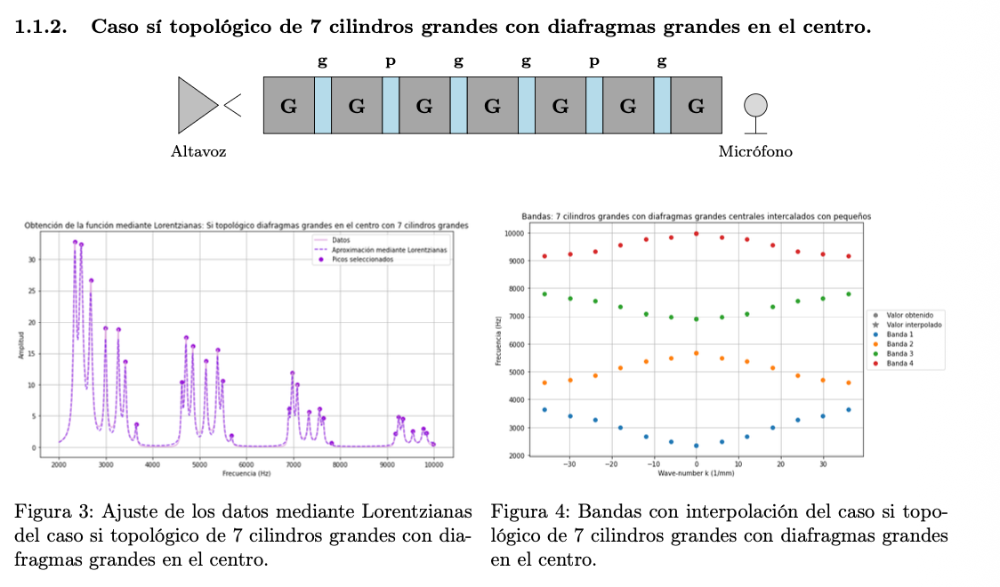
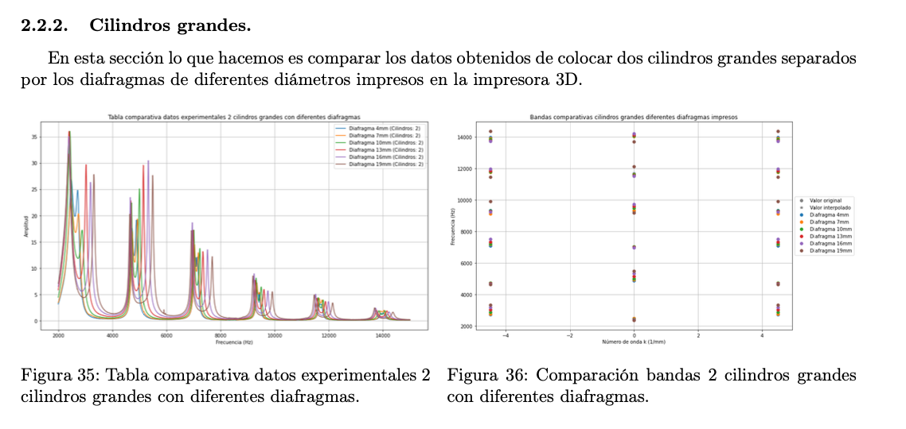

# Examples of Results and Discussion

This document presents selected experimental configurations and explains what each figure demonstrates physically and computationally. The figures combine three important pieces of information: the physical chain configuration, the measured frequency-amplitude response, and the reconstructed band diagram.

## 1. Reading the figures

Most selected figures contain:

1. a schematic of the chain placed between speaker and microphone;
2. a frequency-amplitude plot with detected peaks;
3. a reconstructed band diagram showing frequency as a function of wave number.

The schematic identifies the cylinders and diaphragms. Large cylinders are usually labelled `G`, medium cylinders `M`, and diaphragms are labelled by aperture or relative size. The spectrum shows where acoustic transmission is enhanced. The band diagram organizes the detected resonance frequencies into branches, making gaps and localized features easier to interpret.

Blue or purple points usually indicate band branches. Red stars or highlighted points indicate selected gap-related or topological-candidate points. These highlighted points should be interpreted as candidates, not automatic proof of topology.

## 2. Disordered 8-large-cylinder configuration

This configuration uses eight large cylinders with a non-periodic sequence of diaphragm apertures. The frequency spectrum still shows recognizable groups of resonances, but the internal organization of the peaks is less regular than in a homogeneous chain.

The main physical point is that disorder modifies the coupling pattern without necessarily destroying band formation. Since the cylinders are all large, the approximate frequency regions of the bands remain controlled by the same local resonator length. However, the irregular diaphragms change the effective couplings from site to site. In tight-binding language, the hopping amplitudes are no longer constant.

In the band diagram, this produces distorted branches and highlighted points near irregularities in the spectrum. The result is useful because it illustrates a key warning: band splitting or isolated-looking points can appear from disorder alone. Therefore, topology must be diagnosed by comparing against more symmetric SSH-like configurations.

## 3. Defect produced by 15 large cylinders and one medium cylinder

This case introduces a single medium cylinder into a chain that is otherwise made of large cylinders. This is different from changing a diaphragm. A diaphragm modifies the coupling between neighbouring sites; a different cylinder changes the local resonance frequency of one site.

The result is an on-site defect. In the spectrum, this defect perturbs the regular band structure and can create anomalous or partially isolated peaks. However, this should not be interpreted as a standard SSH topological mode because the perturbation is not primarily a dimerized hopping pattern. It is closer to an impurity in a tight-binding chain.

The reconstructed bands show a distortion around the defect-induced region. This is valuable for the repository because it demonstrates that the code is not only detecting clean SSH-like gaps; it can also analyze less ideal experimental situations where geometry creates local spectral shifts.

## 4. Disordered 16-medium-cylinder configuration

This figure shows a longer chain made of medium cylinders. Increasing the number of resonators increases the number of expected modes per band. Ideally, a 16-cylinder chain should produce approximately 16 modes per band. Experimentally, not all of them are always visible because peaks overlap, broaden, or fall below the detection threshold.

The medium cylinders shift the band positions compared with large cylinders because their local resonance frequencies are different. At the same time, the disordered aperture sequence fragments the bands. The result is a band diagram that retains an overall branch structure but shows missing or irregular points.

This case motivates the missing-mode completion part of the code. Without interpolation, the band diagram would look artificially incomplete. With carefully labelled interpolation, the plot becomes more useful while still distinguishing measured data from reconstructed estimates.

## 5. Weak coupling: 10 large cylinders with 4 mm diaphragms

The 4 mm diaphragms act as very weak acoustic links. Physically, this reduces the transmission between neighbouring cylinders and makes the system closer to a collection of weakly connected resonators.

The measured spectrum shows that the peaks are harder to detect and the band reconstruction becomes less complete. This is exactly what is expected from weak coupling. A small aperture reduces the effective hopping $J$, which narrows the band and makes modes more localized. If the coupling becomes too weak, the system no longer behaves like a clean extended chain.

This figure is important because it explains why intermediate or large diaphragms are often more useful for experimental band reconstruction. Very weak coupling may be theoretically interesting, but the measured signal can become too poor to recover every expected mode.

## 6. Disordered 16-large-cylinder configuration

This case is analogous to the 16-medium-cylinder configuration but uses large cylinders. The frequency window is shifted because the local resonances are different. The larger number of cylinders increases the density of peaks within each band.

The figure illustrates the competition between two effects. A longer chain provides more points for reconstructing a band, which should make the dispersion visually clearer. However, more resonators also mean more closely spaced modes, which can be harder to separate experimentally. As a result, the code must use both physical expectations and numerical peak detection to reconstruct a coherent band diagram.

The highlighted points in the reconstructed bands mark features that deserve attention, but in this disordered case they should be interpreted cautiously. The configuration is useful as a comparison baseline for more intentionally topological chains.

## 7. Topological 24-medium-cylinder configuration with large and medium diaphragms

This is one of the strongest visual results because the chain is long enough to produce a dense and interpretable band structure. The alternating diaphragm pattern creates two effective couplings. In SSH language, these are the two alternating hoppings.

The reconstructed bands show two main branches separated by a visible region associated with the alternating coupling pattern. The highlighted points identify gap-related or topological-candidate features. Compared with shorter chains, the 24-cylinder configuration gives a clearer view of how the branch structure evolves with wave number.

The physical interpretation is that alternating strong and weaker couplings split the original band into sub-bands. If the pattern contains a domain wall or appropriate termination, localized modes can appear near the gap. The important point is that the figure supports an SSH-inspired interpretation because the spectral structure follows from a designed alternating coupling pattern rather than from random disorder alone.

## 8. Topological 24-medium-cylinder configuration with small and large diaphragms

This configuration increases the contrast between weak and strong links by alternating small and large diaphragms. A larger contrast should increase the SSH-like gap, but it can also reduce transmission through weak links. Therefore, the best experimental configuration is not always the one with the strongest theoretical dimerization.

The spectrum shows clear resonance groups, while the band diagram displays separated branches. The stronger dimerization makes the topological interpretation more plausible, but the finite resolution and possible missing peaks must still be considered.

This figure should be used in the README as a high-impact visual because it combines a readable chain schematic, measured peaks, and a band diagram that visibly separates the branches.

## 9. Topological 7-large-cylinder central-mode case

This case is especially useful pedagogically. The chain is short enough that the central defect is easy to discuss. The spectrum contains a peak in a low-transmission region, and the band representation highlights the corresponding gap-related feature.

In SSH language, a central change in the coupling pattern can act as a domain wall between two dimerizations. Such a domain wall can support a localized state. In an acoustic chain, this appears as a resonance that is not part of the ordinary extended band branches.

Because the system is short, finite-size effects are important. The localized mode can hybridize with nearby modes, and the gap may not be perfectly clean. This is why the correct wording is “central localized mode candidate” or “SSH-like defect mode,” not an overconfident claim of perfect topological protection.

## 10. Temperature-dependent topological configuration

Temperature changes the speed of sound approximately as

$$
c(T) \approx 331.5 + 0.6T \quad \text{m/s},
$$

which shifts the resonant frequencies of the cylinders. Therefore, temperature variations introduce a physical perturbation into the acoustic chain.

This figure shows a configuration where cold medium cylinders and alternating diaphragms are used. The band diagram contains highlighted points, but the thermal perturbation means that the interpretation must be careful. A shifted or isolated peak may come from a temperature-induced on-site frequency change rather than from a purely topological domain wall.

This is an excellent figure to include because it demonstrates scientific maturity: the analysis does not simply label every isolated point as topological. It recognizes competing mechanisms.

## 11. Comparative diaphragm-size study with two large cylinders

This comparison isolates the effect of diaphragm aperture. With only two large cylinders, the system is simple enough that changes in the spectrum can be attributed mainly to the coupling element.

The frequency-amplitude plot compares multiple diaphragm sizes. Larger apertures generally increase coupling, which shifts and separates resonant features. Smaller apertures reduce transmission and keep the resonators closer to independent behaviour.

The corresponding band-style plot is not a full many-site band structure, but it is useful as a calibration-style visualization. It shows how the coupling element affects the spectral response before moving to longer chains.

## 12. Global conclusions

The selected results support the following physical picture:

1. **Cylinder size sets the approximate band location.** Large and medium cylinders produce different resonance-frequency regions because their effective lengths differ.
2. **Diaphragm aperture controls coupling.** Larger diaphragms increase effective hopping and broaden bands; smaller diaphragms weaken coupling and make peak detection harder.
3. **The number of cylinders controls the density of modes.** Longer chains should contain more peaks per band, but experimental resolution can hide some modes.
4. **Alternating couplings generate SSH-like band splitting.** Strong/weak diaphragm patterns divide bands into sub-bands and can produce gap-related localized modes.
5. **Defects and temperature can mimic localized features.** Not every isolated peak is topological. On-site defects, disorder, and thermal shifts must be considered.
6. **The code is valuable because it makes incomplete spectra analyzable.** Peak detection, Lorentzian fitting, band grouping, and interpolation together provide a reproducible workflow for extracting physical information from imperfect experimental data.

The strongest version of the repository should present the project as a careful experimental and computational study of acoustic SSH analogues, not as a simplistic topological-mode detector.
